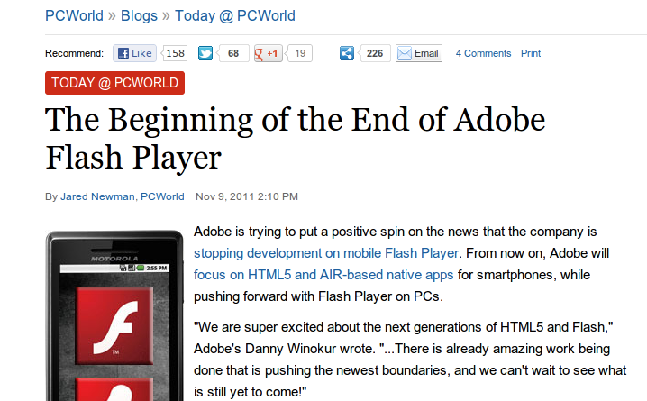
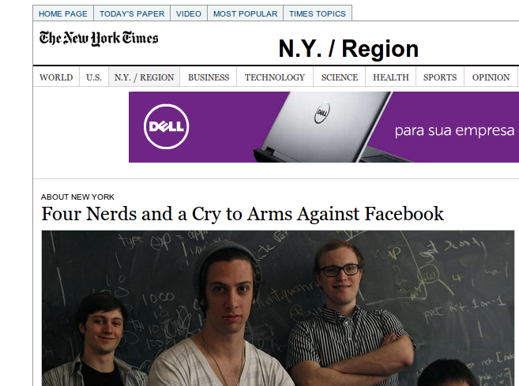

#Desenvolvimento Web
---
#Everaldo Gomes everaldo@dainf.ct.utfpr.edu.br

---

# http://dainf.ct.utfpr.edu.br/ ~everaldo/palestras/ desenvolvimento_web.html

---

---

---

---

---

---

---
#IaaS, PaaS e SaaS

* Infrastructure as a Service (IaaS)
* Platform as a Service (PaaS)
* Software as a Service (SaaS)

---
#HTML5

---
#HTML5

* Marcações Simplificadas
* Web Semântica - Web 2.0
* APIs Javascript
* Offline Applications
* Storage
* Geolocalization
* File System API
* Audio, Video, Canvas

---
#HTML5

* Drag-and-drop
* Inline editing
* WebWorkers (múltiplas threads)
* Websockets

---
#HTML5 - Browser Support

* [Modernizr - Interface uniforme para detecção de suporte dos browsers][modernizr]
* [CanIUse.com - Tabela de compatilidade dos browsers][caniuse_html5]

---

#Javascript

---
#Javascript

---
#Javascript

---
#CSS3

---
#CSS3

* Media queries (css específico por dispositivo/ tamanho de tela)
* Novos seletores
* Pseudo-classes e pseudo-elementos
* WebFonts
* Efeitos de Texto (sombras) e efeitos tipográficos
* Bordas arredondadas
* Transparências
* Transformações

---
#CSS3

---
#Rails

---
#Rails

* Convention over Configuration (CoC)
* Utiliza a linguagem Ruby
* Criado por David Heinemeier Hansson (37signals) 
* Model-View-Controller (MVC)
* Don&apos;t Repeat Yourself (DRY)
* meta-framework (ActiveRecord, ActionMailer, ActionPack, ActiveModel, ActiveSupport) 

---
#Ruby

---
#Ruby

* Linguagem orientada a objetos com tipagem dinâmica
* Algumas características de programação funcional (high order functions)
* Mixins (inclusão de módulos - para simular herança múltipla)
* Duck Typing
* Meta-programação

---
#Ruby

    !ruby
        1.day.from_now 
        => Thu, 10 May 2012 15:32:53 UTC +00:00 
        1.day.from_now 
         => Thu, 10 May 2012 15:32:57 UTC +00:00
        1.year.ago 
         => Mon, 09 May 2011 15:33:00 UTC +00:00
        10.years.from_now
         => Mon, 09 May 2022 15:33:07 UTC +00:00 

        10.years.from_now > 9.years.from_now
         => true 

        ("a".."f").to_a.shuffle
         => ["b", "c", "e", "f", "d", "a"] 

        require 'prime'
         => true 
        Prime.take(10)
         => [2, 3, 5, 7, 11, 13, 17, 19, 23, 29]   

---
#Banco de dados
---
#Bancos de dados relacionais não escalam bem em aplicações web!!!
---
#NoSQL (Not Only SQL)
---
#NoSQL (Not Only SQL)

* Orientado a documentos
* Documentos são objetos JSON armazenados em formato binário
* Mapeamento em memória (limitado em sistemas de 32bits - tamanho máximo do banco aprox. 2GB)
* Sharding e Replicação
---
#Pontos fracos / Limitações da Web 

por John Ousterhout no curso WebApplications da Stanford University:

* Divisão cliente/servidor
* Complicada, desorganizada (muitas linguagens, tecnologias)
* incompleta ("not enough building blocks")
* "HTML é similar a uma linguagem Assembler" (baixo nível)
* problemas de segurança (um pequeno erro pode deixar todo seu sistema vulnerável)

---
#Futuro da Web!?

* [Google Dart][dart]
* [Node.js][nodejs]
* [Diaspora][diaspora_social]
* [Diaspora - código fonte][diaspora_source]
* [Diaspora - projeto][diaspora_project]

---
#Links e Referências
---
#Notícias

- [PCWorld - The Beginning of the End of Adobe Flash Player][flash_rip]
- [Adobe deixa o Flex aos cuidados de uma fundação de código aberto][flash_rip2]
- [Crackers divulgam senhas de 55 mil usuários do Twitter][twitter_crackers] 
- [Kickstarter - Decentralize the web with Diaspora][diaspora-kickstarter]
- [Falha no Gmail atingiu cerca de 35 milhões de pessoas, diz Google][falha_gmail]
- [Four Nerds and a Cry to Arms Against Facebook][diaspora_nytimes]
- [Conheça alguns hábitos inusitados das pessoas com seus smartphones][pesquisaintel]

---
#Mashup

* [Wikipédia - Mashup][mashup]
* [Addthis - content sharing and social insights platform][addthis]
* [Disqus - global comment system][disqus]
* [Google Analytics][google_analytics]
* [Google Ads][google_ads]

---
#Getting Real/ Caindo na Real

* [Caindo na Real][gettingreal_ptbr]
* [Getting Real][gettingreal]

---
#Thoughtbot Playbook

* [Thoughbot Playbook][playbook]

---
#HTML5 

* [HTML5 Rocks - Por que HTML5?][why_html5]
* [HTML5 Rocks - Slides][html5_slides]
* [Compatibility tables for support of HTML5, CSS3, SVG and more in desktop and mobile browsers.][caniuse_html5]
* [HTML5 Boilerplate - HTML/JS/CSS Template for professional frontend developers][html5boilerplate]
* [HTML5 Rocks - Playground - Demo para teste das novas funcionalidades][html5_playground]
* [HTML5 slides de Mathias Bynens][html5_goestoeleven]

---
#Javascript

* [jQuery][jquery]
* [jQueryUI][jqueryui]
* [Modernizr - An open-source JavaScript library that helps you build the next generation of HTML5 and CSS3-powered websites.][modernizr]
* [CoffeeScript - Little language that compiles into JavaScript][coffee]
* [Better JS with CoffeeScript - Sam Stephenson][coffeescript_sthephenson]
* [Spine.js - Javascript MVC Applications][spine]
* [Twitter Bootstrap - Simple and flexible HTML, CSS, and Javascript for popular user interface components 
and interactions][twitter_bootstrap]
* [Javascript Web Applications (book - O&apos;Reilly)][js_applications]

---
#Mobile

* [jQTouch - A Zepto/jQuery plugin for mobile web development on the iPhone, 
Android, iPod Touch, and other forward-thinking devices][jqtouch]
* [Titanium - Create rich native iOS, Android, hybrid, and mobile web apps from a single JavaScript-based SDK][titanium]
* [PhoneGap -  an HTML5 app platform that allows you to author native applications with web technologies and get access to APIs and app stores][phonegap]

---
#Ruby on Rails

* [Site oficial da linguagem Ruby][rubylang]
* [Site oficial do framework Ruby on Rails][rails]
* [Aplicações que utilizam Ruby on Rails][rails-applications]

---
#Aprenda Ruby e Rails

* [Ruby koans][koans]
* [Ruby koans online][koans-online]
* [Railscasts - Screencasts][railscasts]
* [Ruby Rogues - Podcast][rubyrogues]
* [Ruby on Rails Tutorial - Learn Rails by example][rubytutorial]
* [Rubysource][rubysource]
* [OpenClassroom - Web Applications (Stanford) ][openclassroom]
* [Code School - Learn by Doing][codeschool]
* [TryRuby - Tutorial Ruby 15 minutos interativo][tryruby]

---
#Gems

* [Ruby Toolbox - Catalogy of tools][rubytoolbox]
* [Rubygems - is the Ruby community&apos;s gem hosting service][rubygems]
* [Devise - Flexible authentication solution for Rails][devise]
* [Mongoid - Object-Document-Mapper (ODM) for MongoDB written in Ruby][mongoid]
* [Carrierwave - File uploads for Rails, Sinatra and other Ruby web frameworks][carrierwave]
* [Fog - The Ruby cloud services library][fog]
* [Fabrication - Object Generation for Ruby][fabrication]
* [Rspec - Behavior Driven Development Framework (BDD)][rspec]
* [Capybara - Acceptance Test Framework for web applications][capybara]

---
#NoSQL

* [MongoDB][mongodb]

---
#IaaS, PaaS e SaaS

* [Diferenças entre IaaS, PaaS e SaaS][sass-iass-pass]
* [Rackspace][rackspace]
* [Heroku][heroku]
* [Heroku addons][heroku_addons]
* [MongoHQ - MongoDB Hosting in the cloud][mongohq]
* [Airbrake: The error app (coleta erros da sua aplicação)][airbrake]

---
#IaaS, PaaS e SaaS

* [Transloadit - File uploading and encoding that you will love][transloadit]
* [Linode - Deploy and manage Linux Virtual Servers][linode]
* [Engineyard][engineyard]
* [Amazon Web Services - estudos de caso][aws_casestudies]
* [Amazon Web Services - computação científica][aws_science]
* [Amazon Web Services - Elastic Cloud Computing][aws_ec2]

---
#Obrigado!

[dart]: http://www.dartlang.org/
[nodejs]: http://nodejs.org/
[diaspora_source]: https://github.com/diaspora/diaspora
[diaspora_social]: https://joindiaspora.com/
[diaspora_project]: http://diasporaproject.org/

[rails-applications]: http://rubyonrails.org/applications
[rubyrogues]: http://rubyrogues.com/

[devise]: https://github.com/plataformatec/devise
[mongoid]: http://mongoid.org/
[carrierwave]: https://github.com/jnicklas/carrierwave
[fog]: http://fog.io/
[fabrication]: http://fabricationgem.org/
[rspec]: http://rspec.info/
[capybara]: https://github.com/jnicklas/capybara

[rubytoolbox]: https://www.ruby-toolbox.com/
[rubygems]: http://rubygems.org/

[rails]: http://rubyonrails.org
[koans]: http://rubykoans.com/
[koans-online]: http://koans.heroku.com/ 
[railscasts]: http://railscasts.com/
[rubytutorial]: http://ruby.railstutorial.org/
[rubysource]: http://rubysource.com/
[openclassroom]: http://openclassroom.stanford.edu/MainFolder/CoursePage.php?course=WebApplications 
[codeschool]: http://www.codeschool.com/
[tryruby]: http://tryruby.org/
[rubylang]: http://www.ruby-lang.org/

[flash_rip]: http://www.pcworld.com/article/243529/the_beginning_of_the_end_of_adobe_flash_player.html
[flash_rip2]: http://norberto3d.wordpress.com/2011/11/25/adobe-deixa-o-flex-aos-cuidados-de-uma-fundacao-de-codigo-aberto/
[twitter_crackers]: http://idgnow.uol.com.br/internet/2012/05/08/crackers-divulgam-senhas-de-55-mil-usuarios-do-twitter/
[diaspora-kickstarter]: http://www.kickstarter.com/projects/196017994/diaspora-the-personally-controlled-do-it-all-distr
[falha_gmail]: http://blogs.ne10.uol.com.br/mundobit/2012/04/18/falha-no-gmail-atingiu-cerca-de-35-milhoes-de-pessoas-diz-google/
[diaspora_nytimes]: http://www.nytimes.com/2010/05/12/nyregion/12about.html
[pesquisaintel]: http://www.administradores.com.br/informe-se/tecnologia/conheca-alguns-habitos-inusitados-das-pessoas-com-seus-smartphones/54036/

[mashup]: http://pt.wikipedia.org/wiki/Mashup_(aplica%C3%A7%C3%A3o_web)
[addthis]: http://www.addthis.com/
[disqus]: http://disqus.com/welcome/
[google_analytics]: http://www.google.com/analytics/
[google_ads]: http://www.google.com.br/intl/BR/ads/

[sass-iass-pass]: http://microreviews.org/saas-iaas-pass-difference/
[rackspace]: http://www.rackspace.com/
[heroku]: http://www.heroku.com
[mongohq]: https://mongohq.com/home
[airbrake]: http://airbrake.io/
[transloadit]: http://transloadit.com/
[heroku_addons]: https://addons.heroku.com/
[linode]: http://www.linode.com/
[engineyard]: http://www.engineyard.com/
[aws_casestudies]: http://aws.amazon.com/pt/solutions/case-studies/
[aws_science]: http://aws.amazon.com/pt/ec2/spot-and-science/
[aws_ec2]: http://aws.amazon.com/pt/ec2/

[why_html5]: http://www.html5rocks.com/en/why
[html5_slides]: http://slides.html5rocks.com/#landing-slide
[caniuse_html5]: http://caniuse.com/
[html5boilerplate]: http://html5boilerplate.com/
[html5_playground]: http://playground.html5rocks.com/
[html5_goestoeleven]: http://www.slideshare.net/mathiasbynens/html5-it-goes-to-eleven

[jquery]: http://jquery.com/
[jqueryui]: http://jqueryui.com/
[modernizr]: http://modernizr.com/
[coffeescript_sthephenson]: http://vimeo.com/35258313 "Better JS with CoffeeScript - Sam Stephenson "
[coffee]: http://coffeescript.org
[spine]: http://spinejs.com/
[jqtouch]: http://www.jqtouch.com/
[twitter_bootstrap]: http://twitter.github.com/bootstrap/
[js_applications]: http://shop.oreilly.com/product/0636920018421.do
[titanium]: http://www.appcelerator.com/platform/titanium-sdk
[phonegap]: http://phonegap.com/

[gettingreal_ptbr]: http://gettingreal.37signals.com/GR_por.php
[gettingreal]: http://gettingreal.37signals.com/toc.php
[playbook]: http://playbook.thoughtbot.com/

[mongodb]: http://www.mongodb.org

